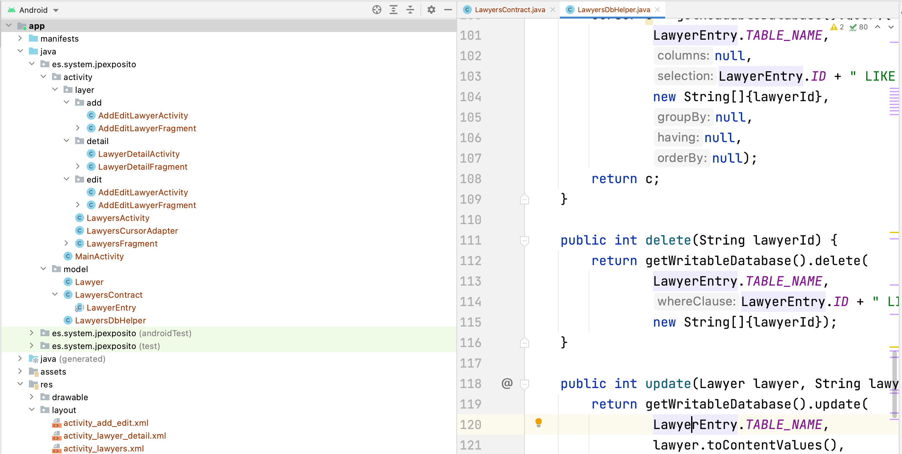

<div align="justify">

# Aplicación Lawyers

</br>

<div align="center">
  
</div>


## Índice

- [Introducción](https://github.com/jpexposito/android/tree/main/mvc/Lawyers#introducci%C3%B3n).
- [Descripción](https://github.com/jpexposito/android/tree/main/mvc/Lawyers#descripci%C3%B3n).
- [Definición del contrato en la BBDD](https://github.com/jpexposito/android/tree/main/mvc/Lawyers#definici%C3%B3n-del-contrato-de-la-base-de-datos).
- [Clases de Interés](https://github.com/jpexposito/android/tree/main/mvc/Lawyers#clases-de-inter%C3%A9s).
- [Librerías Externas](https://github.com/jpexposito/android/tree/main/mvc/Lawyers#librer%C3%ADas-externas).
- [Arquitectura de la App](https://github.com/jpexposito/android/tree/main/mvc/Lawyers#arquitectura-de-la-app).
- [Menú Android](https://github.com/jpexposito/android/tree/main/mvc/Lawyers#men%C3%BA-en-android).
- [Listview en Android](https://github.com/jpexposito/android/tree/main/mvc/Lawyers#listview-en-android).


## Introducción

  La presente aplicación trata de explicar, diferentes conceptos de la programación en __Android__, siguiendo un modelo estructurado. Para ello, se ha utilizado la aplicación ___App Lawyers___ que se encuentra en las referencias del documentos, realizando una actualización de la misma, así como una refactorizacón de su estructura, utilizando el __MVC__, y haciendo uso del __testing__ para verificar su correcto funcionamiento, sin necesidad de tener creada la interfaz gráfica.

## Descripción

  __Lawyers App__ es un pequeño ejemplo que demuestra cómo crear una aplicación Android con bases de datos relacionales.

  Su función es servir como plataforma de persistencia para todos los abogados de una compañía que presta servicios de asesoría a los usuarios.

  Se compone de 3 screens:

  - _Lawyers_: Contiene una lista con todos los abogados del gabinete.
  - _Lawyer Detail_: Muestra el detalle de un abogado al presionar un ítem de lista.
  - _Add/Edit Lawyer_: Formulario con campos de texto para crear o modificar un abogado.

  El siguiente es un wireframe que muestra los puntos de interacción:

  <div align="center">
    
  </div>

## Definición del Contrato De La Base De Datos

  La forma en que una base de datos está estructurada (cantidad de tablas, registros, índices, etc.) y el conjunto de convenciones para nombrar sus objetos se les llama Esquema. Por lo general el esquema inicial se guarda en un Script que nos permita recuperar las condiciones previas en cualquier momento.

  Con __SQLite__ no es diferente, por lo que debes crear un esquema predefinido para implementarlo a la hora de crear tu base de datos.

  La [documentación de Android](https://developer.android.com/training/basics/data-storage/databases.html) nos recomienda crear una clase llamada Contract Class, la cual guarda como constantes todas las características de la base de datos.

### Crear clase de la entidad abogado

  Nuestro ejemplo está basado es un diseño compuesto de una entidad llamada Lawyer, cuyos atributos son:
  - id
  - nombre
  - especialidad
  - número de teléfono
  - biografía
  - avatar


  Para representarla crea un nuevo paquete Java con el nombre data. Dentro de este, añade una clase llamada Lawyer.

```java
/**
 * Entidad "abogado"
 */
public class Lawyer {
    private String id;
    private String name;
    private String specialty;
    private String phoneNumber;
    private String bio;
    private String avatarUri;

    public Lawyer(String name,
                  String specialty, String phoneNumber,
                  String bio, String avatarUri) {
        this.id = UUID.randomUUID().toString();
        this.name = name;
        this.specialty = specialty;
        this.phoneNumber = phoneNumber;
        this.bio = bio;
        this.avatarUri = avatarUri;
    }

  ...
}
```

- __Nota__: La clase se encuentra en __es.system.jpexposito.model.Lawyer__.

### Esquema de Lawyer App

El esquema se establecerá en una clase donde definirás los nombres de tablas, columnas y uris para un uso global.

Añade dentro del paquete data una nueva clase llamada LawyersContract y define una clase interna con los datos de la tabla "lawyer" que se creará en la base de datos, __LawyersContract.java__.

```java
/**
 * Esquema de la base de datos para abogados
 */
public class LawyersContract {

    public static abstract class LawyerEntry implements BaseColumns{
        public static final String TABLE_NAME ="lawyer";

        public static final String ID = "id";
        public static final String NAME = "name";
        public static final String SPECIALTY = "specialty";
        public static final String PHONE_NUMBER = "phoneNumber";
        public static final String AVATAR_URI = "avatarUri";
        public static final String BIO = "bio";
    }
}

```
- __Nota__: La clase se encuentra en __es.system.jpexposito.model.Lawyer__.

En el anterior código podemos notar los siguientes detalles:

- Creamos la clase interna __LawyerEntry__ para guardar el nombre de las columnas de la tabla.
- Se implementó la interfaz __BaseColumns__ con el fin de agregar una columna extra que se recomienda tenga toda tabla (__ID__).
- Estas declaraciones facilitan el mantenimiento del esquema, por si en algún momento cambian los nombres de las tablas o columnas.

### Clases de Interés

#### SQLiteOpenHelper

  La clase que nos permitirá comunicar nuestra aplicación con la base de datos se llama __SQLiteOpenHelper__. Se trata de una _clase abstracta_ que nos provee los mecanismos básicos para la relación entre la aplicación Android y la información.

  Para implementar este controlador debes:
  - Crear una clase que extienda de __SQLiteOpenHelper__.
  - Configurar un constructor apropiado. ___Recuerda que en función si nuestra app, tiene una o varias tablas en la BBDD, deberemos de tener un ComunHelper y que sea este el que cree la BBDD, y los que extiendan de este, las tablas correspondientes___.
  - Sobrescribir los métodos __onCreate()__ y __onUpgrade()__, en _función de nuestras necesidades_.

  ```java
  public class LawyersDbHelper extends SQLiteOpenHelper {
  ```

  Los parámetros del constructor tienen la siguiente finalidad:
  - __Context context__: Contexto de acción para el helper.
  - __String name__: Nombre del archivo con extensión __.db__, donde se almacenará la base de datos, que a su vez corresponde al nombre de la base de datos.
  - __CursorFactory factory__: Asignamos null, por ahora no es necesario comprender el funcionamiento de este parámetro.
  - __int version__: Entero que representa la versión de la base de datos. Su valor inicial por defecto es 1. Si en algún momento la versión es mayor se llama al método __onUpgrade()__ para actualizar la base de datos a la nueva versión. Si es menor, se llama a __downUpgrade()__ para volver a una versión previa.

  En el método __onCreate()__ realizaremos la llamada al método __mook__ con el objetivo de insertar datos en la __BBDD__, aunque la forma de realizarlo de forma correcta, será a través de un ___script sql___.

### Leer Información De La Base De Datos

#### Método query

  Para obtener los registros de nuestra tabla usaremos el método __query()__.

```java
  Cursor c = query(
      table,  // Nombre de la tabla
      null,  // Lista de Columnas a consultar                              
      null,  // Columnas para la cláusula WHERE                               
      null,  // Valores a comparar con las columnas del WHERE                           
      null,  // Agrupar con GROUP BY                                    
      null,  // Condición HAVING para GROUP BY                                     
      null  // Cláusula ORDER BY                                
      );
```

  ___Como resulta evidente podríamos realizar un método común, llamado por ejemplo SEARCH que reciba los siguientes parámetros con el fin de que todos los métodos de búsqueda necesarios hagan uso de éste___.

  Los parámetros de la sentencia __query__ son:
  - __String table__: Nombre de la tabla a consultar
  - __String[] columns__: Lista de nombres de las columnas que se van a consultar. Si deseas obtener todas las columnas usas null.
  - __String selection__: Es el cuerpo de la sentencia WHERE con las columnas a condicionar. Es posible usar el placeholder '?' para generalizar la condición.
  - __String[] selectionArgs__: Es una lista de los valores que se usaran para reemplazar las incógnitas de selection en el WHERE.
  - __String groupBy__: Aquí puedes establecer cómo se vería la cláusula GROUP BY, si es que la necesitas.
  - __String having__: Establece la sentencia HAVING para condicionar a groupBy.
  - __String orderBy__: Reordena las filas de la consulta a través de ORDER BY.

  __Un ejemplo sería__:

  ```java
  String columns[] = new String[]{LawyerEntry.NAME};
  String selection = LawyerEntry.ID + " LIKE ?"; // WHERE id LIKE ?
  String selectionArgs[] = new String[]{"L-001"};

  Cursor c = db.query(
          LawyerEntry.TABLE_NAME,
          columns,
          selection,
          selectionArgs,
          null,
          null,
          null
  );
  ```

  #### Método rawQuery

    Existe otro método alternativo para realizar consultas llamado __rawQuery()__. Con él pasas como parámetro un String del código SQL de la consulta.

    Veamos:

    ```java
    db.rawQuery("select * from " + LawyerEntry.TABLE_NAME, null);
    ```

    Si deseas crear una consulta generalizada usa el __placeholder'?'__ en la cláusula __WHERE__. Luego asigna los valores a cada incógnita en el segundo parámetro:

    ```java
    String query = "select * from " + LawyerEntry.TABLE_NAME + " WHERE _id=?";
    database.rawQuery(query, new String[]{"3"});

    ```


### Cursores en SQLite

  Tanto __query()__ como __rawQuery()__ retornan un objeto de tipo __Cursor__.

  Un ejemplo de ello:

  ```java
  public Cursor getLawyerById(String lawyerId) {
    Cursor c = getReadableDatabase().query(
            LawyerEntry.TABLE_NAME,
            null,
            LawyerEntry.ID + " LIKE ?",
            new String[]{lawyerId},
            null,
            null,
            null);
    return c;
  }
  ```

  Para hacer uso de los cursores será necesario realizar el recorrido de este a través de un bucle, por ejemplo __while__ y construir el elemento __(Lawyer)__ o conjunto de elementos que retorne __(List\<Lawyer\>)__.

### Librerías Externas

  Android permite la carga de librerías externas para ser utilizadas dentro de las app.

#### Glide

  Glide es una librería para Android que fue introducida por Google, que es utilizada para descargar y guardar en memoria cache las imágenes que se desean mostrar en nuestras aplicaciones.

##### ¿Por qué usarla?

  Porque esta librería nos simplifica el proceso de cargar imágenes desde una url y nos permite mostrarlas en nuestras aplicaciones.

  El desarrollo de __Glide__, se encuentra en el siguiente [enlace](https://github.com/bumptech/glide), viendo que es un __proyecto vivo__, y para comprender su uso podemos ver el siguiente [post](https://medium.com/@alexmendozaventura/android-primeros-pasos-con-glide-f26a9db303ee).

###### Importación

  Para hacer uso de ella, debemos de introducir su referencia en el fichero __build.gradle__ de la siguiente forma:

  ```console
  classpath "com.github.bumptech.glide:glide:4.12.0"

  ```

  en en la etiqueta de depencias del proyecto:

  ```console
  implementation 'com.github.bumptech.glide:glide:4.12.0'
  ```

###### Utilización

  Para hacer uso de esta librería, debemos de realizar la carga de la imagen que deseamos mostrar, e indicar como deseamos mostrarla:

  ```java
  Glide.with(context)
                .asBitmap()
                .load(Uri.parse("file:///android_asset/" + avatarUri))
                    .into(new BitmapImageViewTarget(avatarImage) {
                        @Override
                        protected void setResource(Bitmap resource) {
                            RoundedBitmapDrawable drawable
                                    = RoundedBitmapDrawableFactory.create(context.getResources(), resource);
                            drawable.setCircular(true);
                            avatarImage.setImageDrawable(drawable);
                        }
                    });
  ```

##### Otras librerías

  En el proyecto se hace uso de otras librerías. La forma de referenciar y hacer uso, es la misma que la indicada anteriormente. Algunas de ellas son:

  ```console
  implementation 'com.github.bumptech.glide:glide:4.12.0'
  implementation 'androidx.coordinatorlayout:coordinatorlayout:1.1.0'
  implementation 'com.google.android.material:material:1.0.0'
  ```

## Arquitectura de la App  

  La aplicación sigue una arquitectura MVC, con el fin de estructurar la app y la información que contiene y muestra. En la siguiente imagen podemos ver la estructura de la app:

  </br>

  <div align="center">
    
  </div>

  </br>

  Como se pude obervar se estructurado la aplicación en el __modelo__, a través del paquete model, y el paquete __activity__ que contiene la referencia a todas las capas visuales de la app, haciendo uso las unas de las otras.


## Menú en android

Para definir el menú, crea un archivo en formato XML dentro del directorio __res/menu/__ del proyecto y desarrolla el menú con los siguientes elementos:
- __\<menu\>__.Define un Menu, que es un contenedor para elementos de menú. Un elemento \<menu\> debe ser el nodo raíz del archivo y puede tener uno o más elementos \<item\> y \<group\>.
- __\<item\>__. Crea un MenuItem, que representa un único elemento en un menú. Este elemento puede contener un elemento \<menu\> anidado para crear un submenú.
- __\<group\>__. Es un contenedor opcional e invisible para elementos __\<item\>__. Te permite categorizar los elementos de menú para que compartan propiedades, como el estado de la actividad y la visibilidad.
Aquí presentamos un menú de ejemplo denominado game_menu.xml:

```xml
<?xml version="1.0" encoding="utf-8"?>
<menu xmlns:android="http://schemas.android.com/apk/res/android">
<item android:id="@+id/new_game"
      android:icon="@drawable/ic_new_game"
      android:title="@string/new_game"
      android:showAsAction="ifRoom"/>
<item android:id="@+id/help"
      android:icon="@drawable/ic_help"
      android:title="@string/help" />
</menu>
```

### Tipos de Menú

#### Menú de opciones y barra de la app

  El menú de opciones es la colección principal de elementos de menú de una actividad. Es donde debes colocar las acciones que tienen un impacto global en la app, como "Buscar", "Redactar correo electrónico" y "Configuración".[Más información](https://developer.android.com/guide/topics/ui/menus?hl=es-419#options-menu).

#### Menú contextual y modo de acción contextual

  Un menú contextual es un menú flotante que aparece cuando el usuario hace un clic largo en un elemento. Proporciona acciones que afectan el contenido seleccionado o el marco contextual.

  En el modo de acción contextual, se muestran los elementos de acción que afectan al contenido seleccionado en una barra en la parte superior de la pantalla y se permite al usuario seleccionar varios elementos.[Más información](https://developer.android.com/guide/topics/ui/menus?hl=es-419#context-menu).


#### Menú emergente

  Un menú emergente muestra una lista de elementos en una lista vertical que está anclada a la vista que invocó el menú. Es adecuado para proporcionar una ampliación de acciones relacionadas con contenido específico o para proporcionar opciones en una segunda parte de un comando. Las acciones de un menú emergente no deben afectar directamente al contenido correspondiente, ya que para eso están las acciones contextuales. En cambio, el menú emergente es para acciones extendidas relacionadas con partes del contenido de la actividad. [Más información](https://developer.android.com/guide/topics/ui/menus?hl=es-419#PopupMenu).

### Menú App Lawyer

  La aplicación dispone de dos menús. Nos centraremos en el menú que permite modificar o eliminar el __Lawyer__ seleccionado previamente.

  ```xml
  <menu xmlns:android="http://schemas.android.com/apk/res/android"
    xmlns:app="http://schemas.android.com/apk/res-auto"
    xmlns:tools="http://schemas.android.com/tools"
    tools:context="es.system.jpexposito.activity.layer.detail.LawyerDetailActivity">
    <item
        android:id="@+id/action_edit"
        android:orderInCategory="1"
        android:title="@string/action_edit"
        android:icon="@drawable/ic_pencil"
        app:showAsAction="ifRoom" />

    <item
        android:id="@+id/action_delete"
        android:orderInCategory="2"
        android:icon="@drawable/ic_delete"
        android:title="@string/action_delete"
        app:showAsAction="ifRoom" />
</menu>
  ```

Si atendemos a su estructura es similar a los layout de nuestra app, teniendo en cuenta:

- __tools:context__. Que hace referencia a la clase encargada de gestionar las acciones que se realizan en el menú.
- __android:id__. Nombre de la accción.
- __android:icon__. Icono asociado.
- ...

## Listview en Android

  Las listas en Android son __contenedores útiles__ para organizar información en forma vertical y con la capacidad de usar scrolling (desplazamiento) para simplificar su visualización.

  Esta técnica es muy popular en muchas aplicaciones, ya que permite mostrarle al usuario un conjunto de datos de forma práctica y accesible.

  __Google__ liberó otro componente alternativo llamado __RecyclerView__ para crear listas y grillas.

  El uso sería el siguiente:

  ```xml
  <ListView
    android:id="@+id/lawyers_list"
    android:layout_width="match_parent"
    android:layout_height="match_parent"
    android:divider="@null"
    tools:listitem="@layout/list_item_lawyer" />
  ```

  Los pasos para su utilización serían:
  - Definición de la variable.
  ```java
  private ListView mLawyersList
  ```
  - Enlazar. Enlaza la variable anterior con el elemento __ListView__ de la vista diseño.
  ```java
  mLawyersList = (ListView) root.findViewById(R.id.lawyers_list);
  mLawyersAdapter = new LawyersCursorAdapter(getActivity(), null);
  mLawyersList.setAdapter(mLawyersAdapter);

  ```

  La carga de datos se realiza a través de:

  ```java
    loadLawyers();
  ```

## Referentecias

- [App Lawyers](https://www.develou.com/android-sqlite-bases-de-datos/).
- [Menús en Android](https://developer.android.com/guide/topics/ui/menus?hl=es-419).
- [Listview en Android](https://naps.com.mx/blog/uso-de-un-listview-en-android/).

</div>
